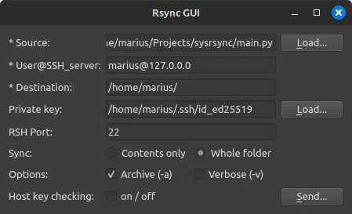

# PySync - rsync GUI in python

**Purpose of this project:** I use rsync infrequently enough to forget how to properly format the CLI input, especially when a private key is used.

GUI is here for the ease of use.




Equivalent to: 

```bash
rsync --rsh='ssh -i /home/marius/.ssh/id_ed25519' sync_source_contents=False -a /home/marius/Projects/sysrsync/main.py marius@127.0.0.0:/home/marius
```


## Running PySync

```bash
# Clone the repository and cd in
git clone https://github.com/0xMarius/pysync.git
cd pysync/

# (Optional) Create virtual environment
python -m venv ./.env
source .env/bin/activate

# Install dependencies
pip install -r requirements.txt
```


## To-do

**Contributions welcome!**

- Password prompt

- Source folders, currently only accepting files

- Cache previous inputs

- Exclusions
